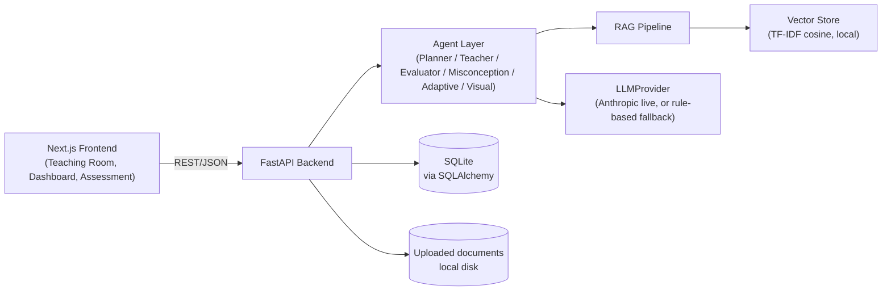
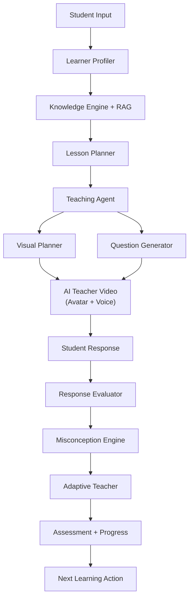
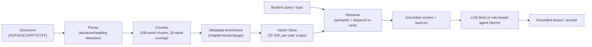
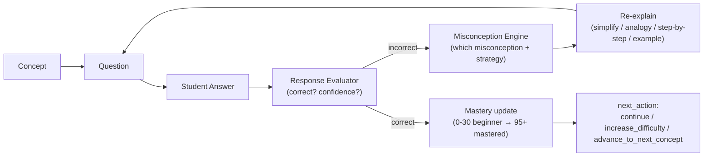

# AUTOPSY

**AI Teacher That Understands. Explains. Interacts. Adapts.**

AUTOPSY is not a chatbot with a nice UI wrapped around an LLM call. It is a
teaching *system*: a learner profile, a RAG-grounded knowledge engine, a
lesson planner, a teaching agent with explicit state, a misconception engine,
an adaptive mastery model, and an assessment/reporting layer — all wired
together into one closed loop:

```
UNDERSTAND → PLAN → EXPLAIN → DEMONSTRATE → QUESTION → EVALUATE → ADAPT → CONTINUE
```

---

## 1. Problem

Most "AI tutors" are a chat window on top of an LLM: ask a question, get an
answer. They don't plan a lesson around your time budget, don't track *why*
you got something wrong, and don't adapt their teaching strategy — they just
answer the next message. Students don't get taught, they get answered.

## 2. Solution

AUTOPSY treats the student as a **knowledge state**, not a chat history. For
every concept it tracks mastery, confidence, attempts, and misconception
history, and it uses that state to decide what to teach next, how to explain
it, and when to change strategy — the same loop a human tutor runs.

## 3. Why AUTOPSY is different

| Typical AI tutor | AUTOPSY |
|---|---|
| "Incorrect." | Detects *which* misconception, re-teaches with a different strategy, re-asks |
| One LLM call in, text out | Specialized agents: planner, teacher, question generator, evaluator, misconception engine, adaptive engine, visual planner |
| Ungrounded answers | RAG over your uploaded material, with chapter/page source attribution |
| Static difficulty | Mastery-banded adaptive difficulty (0–30% beginner → 95%+ mastered) |
| Text wall | Subject-aware visuals: equations, circuit-style diagrams, timelines, code, concept cards |
| English only | English / Hindi / Hinglish, mid-lesson switchable |

## 4. Features

- Structured onboarding → learner profile (level, language, teaching style, goal, time budget)
- Document ingestion (PDF/DOC/DOCX/PPT/PPTX/TXT) with chapter/section/page-aware chunking
- RAG retrieval with source attribution ("Based on your material — Chapter 4, page 27")
- Duration-aware Lesson Planner (5 min essentials / 20 min standard / 60 min deep / multi-day path)
- Teaching Agent with explicit, inspectable state (`mastery`, `difficulty`, `attempts`, `misconceptions`, `next_action`)
- Misconception Engine that diagnoses *why* an answer is wrong and picks a re-teaching strategy
- Adaptive mastery model with mastery-banded difficulty
- Subject-aware Visual Planner (equation / diagram / timeline / code / concept card)
- AI Teacher "video" experience: CSS/SVG avatar synced to narrated speech + live subtitles
- Voice: browser-native speech-to-text and text-to-speech (mic input, play/pause/replay/speed/mute)
- Multilingual: English / Hindi / Hinglish, mid-lesson
- Final assessment → score, strong/weak areas, misconceptions, revision plan, next-topic recommendation
- Persistent learner model (concept mastery, misconceptions, learning path) that carries across lessons
- Demo Mode: the entire loop above works with **zero external API keys**

## 5. Architecture



## 6. AI architecture (agents)



Every box above is a real, separately-testable Python module under
`backend/app/services/agents/` — not one giant prompt. See
[`backend/app/services/agents/`](backend/app/services/agents/).

## 7. RAG architecture



Uploaded documents are treated as **untrusted content**: they are parsed to
plain text only, chunked, embedded, and retrieved — never executed or
interpreted as instructions to the system.

## 8. Adaptive learning loop



## 9. Personalization

Onboarding captures level, language, teaching style, goal, and available time
and stores it as a `LearnerProfile`. Every subsequent lesson plan, question
difficulty, and explanation style reads from this profile plus the learner's
live `ConceptMastery` state — not just the current message.

## 10. Adaptive teaching

The `TeachingAgent` (`backend/app/services/agents/teaching_agent.py`) holds
an explicit state object per lesson:

```json
{ "current_concept": "resistance", "mastery": 0.42, "difficulty": "guided_practice",
  "attempts": 2, "misconceptions": ["inverse_relationship_confusion"], "next_action": "re_explain_with_analogy" }
```

This state — not a hidden prompt — drives what happens next. It's visible in
the Teaching Room UI (mastery bar + "Detected: …" banner) so the adaptive
loop is demonstrable, not a black box.

## 11. Misconception detection

`backend/app/services/agents/misconception_engine.py`. Curated sample content
(`backend/app/data/sample_content.py`, the "Ohm's Law" demo lesson) maps
specific wrong answers to specific, pedagogically real misconceptions (e.g.
picking "Current increases" when resistance rises maps to
`inverse_relationship_confusion` with a water-pipe analogy re-explanation).
For generic/uploaded content without curated mappings, the engine falls back
to a strategy-rotation diagnosis (simplify → analogy → step-by-step →
real-world example) driven by answer-confidence overlap, or — when an LLM key
is configured — a live classification call.

## 12. Video generation

`AvatarPlayer` (`frontend/src/components/AvatarPlayer.tsx`) is the
`VideoProvider` implementation used by default: a CSS/SVG avatar synced to
the Web Speech API (browser-native TTS) with live word-tracked subtitles,
speed/mute/replay controls, and mood color tied to teaching state
(re-explaining = amber, teaching = indigo). The `VisualPanel` component
renders the Visual Planner's output alongside it (equations, diagrams,
timelines, code, concept cards) — never a wall of text.

This is intentionally provider-abstracted: a paid photorealistic avatar API
(HeyGen/D-ID/Synthesia) can replace `AvatarPlayer`'s rendering without
touching the Teaching Room, since it only needs `{text, language, uiState}`.

## 13. Voice

Browser-native, free, no API key: `SpeechSynthesis` for TTS,
`SpeechRecognition` for STT (`frontend/src/lib/speech.ts`). Mic button
appears only when the browser supports it; typing always works as a fallback.

## 14. Avatar

See §12. Deliberately not a static image with a text bubble: mouth animates
while speaking, color/mood shifts with teaching state, and subtitles
word-track the narration via `SpeechSynthesisUtterance.onboundary`.

## 15. Multilingual system

Two layers:
- **UI chrome** (`frontend/src/lib/i18n.ts`): a small English/Hindi/Hinglish
  dictionary for labels/buttons — works offline, no LLM.
- **Lesson content** (`backend/app/services/providers/translator.py`): live
  mode calls the LLM for full-fidelity translation; demo mode uses a curated
  phrase-substitution dictionary that code-switches common teaching
  connectors into Hindi while keeping technical nouns in English — the same
  strategy real Hinglish ed-tech content uses.

## 16. Assessment

`backend/app/services/agents/assessment_agent.py` builds a mixed MCQ +
conceptual assessment from the lesson's concepts, then scores it into strong
areas, weak areas, misconceptions seen, a revision list, and a next-topic
recommendation — see the Results screen.

## 17. Learning profile

`LearnerProfile`, `ConceptMastery`, `Misconception`, `LearningPath`, and
`LearningEvent` (all in `backend/app/models.py`) persist across lessons. The
Dashboard reads live from this state (overall mastery, weak concepts, streak,
recommended next).

## 18. Tech stack

- **Frontend**: Next.js 16 (App Router), TypeScript, Tailwind CSS
- **Backend**: Python 3.13, FastAPI, SQLAlchemy, SQLite
- **RAG**: pypdf / python-docx / python-pptx for extraction, scikit-learn
  TF-IDF + cosine similarity for retrieval (no external vector DB service to
  stand up — see Limitations)
- **LLM**: Anthropic Claude via the official `anthropic` SDK, behind a
  `LLMProvider` interface (`backend/app/services/providers/llm.py`)
- **Voice/Avatar**: browser-native Web Speech API + CSS/SVG, behind a
  swappable component contract

## 19. APIs / third-party services

| Service | Used for | Required? |
|---|---|---|
| Anthropic Claude API | Live lesson script generation, question wording, nuanced grading, misconception classification, live translation | **No** — app runs fully in Demo Mode without it |
| Browser Web Speech API | TTS + STT | No key needed; browser feature (Chrome/Edge best support) |

No other third-party APIs are called. No user data leaves the machine except
to the Anthropic API, and only if `ANTHROPIC_API_KEY` is set.

## 20. Setup

**Backend**
```bash
cd backend
python -m venv .venv
./.venv/Scripts/pip install -r requirements.txt   # .venv/bin/pip on macOS/Linux
cp .env.example .env                              # optionally set ANTHROPIC_API_KEY
./.venv/Scripts/python -m uvicorn app.main:app --port 8000 --reload
```

**Frontend**
```bash
cd frontend
npm install
npm run dev     # http://localhost:3000
```

Open `http://localhost:3000`, sign up, and either try the built-in **Ohm's
Law** sample lesson or upload your own PDF/DOCX/PPTX/TXT.

## 21. Environment variables

Backend `.env` (see `backend/.env.example`):
```
ANTHROPIC_API_KEY=      # optional — unset = Demo Mode (see /api/system/status)
```

Frontend `.env.local`:
```
NEXT_PUBLIC_API_URL=http://localhost:8000
```

## 22. Deployment

This build targets local/dev deployment for the assessment. For a real
deployment: run the FastAPI app behind Uvicorn/Gunicorn (or a container),
point SQLite at a persistent volume (or swap `DATABASE_URL` for Postgres —
the SQLAlchemy models don't assume SQLite), serve the Next.js app via
`next build && next start` or a static/Vercel-style deployment with
`NEXT_PUBLIC_API_URL` pointed at the backend's public URL, and set
`ANTHROPIC_API_KEY` as a real secret (never commit it).

## 23. Testing

Backend: `cd backend && ./.venv/Scripts/python -m pytest tests/ -q`
- Unit tests for the adaptive engine, misconception engine, response
  evaluator, visual planner, chunker, and assessment question generation
- An integration test that runs the full golden-path demo loop end-to-end
  through the real HTTP API (FastAPI `TestClient`) in Demo Mode: onboard →
  plan the Ohm's Law sample lesson → answer incorrectly → confirm the
  curated misconception fires → answer correctly → confirm mastery
  increases → generate + submit the assessment → confirm the report

Frontend: `cd frontend && npx tsc --noEmit && npx eslint src && npx next build`
verifies types, lint, and that every route (including the ones using
`useSearchParams`) builds and prerenders cleanly.

The full teaching loop was also walked manually in a real browser (see
demo flow below) to confirm the UI, not just the API, behaves correctly.

## 24. Limitations

Being upfront about what's a deliberate simplification for this build, not a
hidden gap:

- **Vector store is TF-IDF + cosine similarity, not a neural embedding
  model.** It needs no model download and no GPU, which matters on modest
  hardware, but it won't catch pure paraphrase/synonym matches the way a
  sentence-embedding model would. The `VectorStoreProvider` interface is
  designed so a real embedding model + Pinecone/Chroma/pgvector can replace
  it without touching the retrieval or ingestion call sites.
- **No paid avatar/video provider is wired in.** The AI Teacher "video" is a
  CSS/SVG avatar + browser TTS, not a photorealistic generated video — by
  design (see the onboarding decision to build without external API keys).
  `AvatarPlayer`'s `{text, language, uiState}` contract is the seam where a
  HeyGen/D-ID/Synthesia integration would plug in.
- **Demo Mode translation is dictionary-based**, not a full machine
  translation model — it code-switches common teaching phrases into
  Hindi/Hinglish while leaving domain terms in English. Full free-text
  translation requires a live LLM key.
- **Single-user-oriented auth**: onboarding creates a user by email with no
  password/session security — there's no login step, just a stored
  `user_id`. Fine for a local demo; not production auth.
- **Background jobs run inline**, not on a task queue: document ingestion
  happens synchronously in the upload request. Fine for the small demo files
  this is built for; a large PDF or many concurrent uploads would benefit
  from a real job queue (Celery/RQ) — the `Document.status` state machine
  (`uploaded → processing → ready/failed`) already models what a queued job
  would need.
- **P2 features from the spec (flashcards, concept maps, emotion-aware
  interaction, multi-day spaced revision UI) are not built** — P0/P1 was the
  agreed scope for this build; the `LearningPath` agent and data model
  already support extending into them.

## 25. Future work

- Swap the TF-IDF vector store for a real embedding model + hosted vector DB
- Wire a paid `AvatarProvider`/`VideoProvider` behind the existing interface
- Move document ingestion to a background job queue with progress streaming (SSE/WebSocket)
- Real auth (password or OAuth) instead of email-only identification
- Spaced-repetition scheduling on top of `ConceptMastery.last_reviewed`
- Multi-day learning-path UI (the agent and data model already support it)

---

## Demo flow

1. Onboard as a beginner, language Hindi, teaching style balanced.
2. On the Dashboard, click **Start Learning** → pick the **Ohm's Law** sample lesson → 20 minutes → **Teach Me**.
3. Review the AI-generated Lesson Plan Preview (objectives, grounded-in-material badge) → **Start Teaching**.
4. Watch the AI teacher narrate "Voltage" with a synced diagram; answer the checkpoint question.
5. On the **Ohm's Law** section, deliberately answer *"Current increases"* — watch AUTOPSY detect
   `inverse_relationship_confusion` and re-explain with the water-pipe analogy.
6. Answer correctly on retry — mastery and difficulty band visibly update.
7. Finish the lesson → **Start Assessment** → submit → view the **Learning Report** (score, strong/weak areas,
   misconceptions, recommended next topic).
8. Check **Progress** and the **Dashboard** — both reflect the same persisted learner state.
